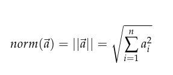
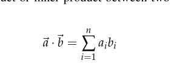

# Lab 1

# Numpy

### used for array manipulation , used to operate on large multidimentional array in few lines
```python
import numpy as np
# defining list 
plist = [1]

# defining array 
parr = np.array([1])

```

## Algebraic operations on array and list

### '+' using array will do element-wise addition while the '+' for list will concatenate it

```python
print(narray + narray)
print(alist + alist)

# [2 4 6 8] needs to be same size / shape 
# [1, 2, 3, 4, 5, 1, 2, 3, 4, 5] 

```

### It is the same as with the product operator, *. In the first case, we scale the vector, while in the second case, we concatenate three times the same list.


```python
print(narray * 3)
print(alist * 3)
# [ 3 6 9 12]
# [1, 2, 3, 4, 5, 1, 2, 3, 4, 5, 1, 2, 3, 4, 5]

```
### Element wise operations

```python

import numpy as np
print(x+y)
print(x-y)
print(x*y)
print(x/y)

# alterative way 

print(np.add(x,y))
print(np.subtract(x,y))
print(np.multiply(x,y))
print(np.divide(x,y))
np.sqrt(x)
# matrix multiplication 

a.dot(b)
a @ b 

```

# Useful numpy methods for ML

- norms
  

- dot product
  

### **Note** :- norm is square root of the dot product of the vector with itself

## Why Use Mean-Centered Data in Machine Learning?
Mean centering is a preprocessing step commonly used in machine learning. Here’s why it’s important:

1. Improves Algorithm Convergence
   Many machine learning algorithms, such as Gradient Descent (used in linear regression, logistic regression, etc.), perform better or converge faster when the data is mean-centered. When features are centered around zero, the optimization algorithms don't need to adjust for large values, which helps in faster and more stable convergence.
2. Removes Bias Due to Feature Magnitudes
   Features in the dataset might have different scales (e.g., one feature ranges from 0 to 1000, while another ranges from 0 to 1). This discrepancy in scales can make some algorithms (like K-Nearest Neighbors, Support Vector Machines, and Principal Component Analysis) behave inefficiently. Mean centering removes this bias by ensuring that each feature has a comparable starting point (mean = 0).

The scatter plot you are referring to was likely drawn to visualize the relationship between two continuous variables in the **Iris dataset**: **Sepal Length (cm)** and **Sepal Width (cm)**. By plotting these two variables, you can see how they are related or if there is any pattern in their correlation. Here’s why this scatter plot is useful:

### **Purpose of Scatter Plot:**
1. **Identifying Correlation:**
    - The scatter plot helps us assess whether there is a linear or non-linear relationship between Sepal Length and Sepal Width.
    - A positive correlation would indicate that as one value increases, the other also increases, whereas a negative correlation would indicate that as one value increases, the other decreases.

2. **Visualizing Data Distribution:**
    - By plotting these two variables, the scatter plot shows how the data points are distributed across the plot. You can visually assess if the data is clustered, uniformly distributed, or has any outliers.

3. **Identifying Outliers:**
    - Outliers can be seen in a scatter plot if any points deviate significantly from the overall pattern or trend of the data.

4. **Exploratory Data Analysis (EDA):**
    - Scatter plots are a key component of EDA. By visualizing the data, you can identify important characteristics or anomalies in the dataset before applying machine learning models or statistical tests.

5. **Understanding Species Separation:**
    - If the plot is colored by species, the scatter plot can also show whether the Sepal Length and Sepal Width are good features to distinguish between species in the Iris dataset. This would be useful for classification models.

To draw a histogram of the **SepalLengthCm** column, you would use the following code in Python with Matplotlib:

```python
import matplotlib.pyplot as plt

# Assuming the iris dataset is already loaded into the variable 'iris'
plt.figure(figsize=(8, 6))
plt.hist(iris['SepalLengthCm'], bins=10, color='blue', alpha=0.7)
plt.title('Histogram: Sepal Length Distribution')
plt.xlabel('Sepal Length (cm)')
plt.ylabel('Frequency')
plt.grid(True)
plt.show()
```
In summary, the histogram allows you to gain insights into the distribution and characteristics of the **SepalLengthCm** feature, which helps in the preprocessing and understanding of the data for building better machine learning models.

### **Purpose of Drawing a Histogram in Machine Learning:**

1. **Understanding Data Distribution:**
    - A histogram is a great way to visualize the distribution of a dataset. It divides the data into bins (intervals) and shows how many data points fall into each bin.
    - This can help understand whether the data is normally distributed, skewed, or follows another distribution, which is important for choosing the right machine learning model or technique.

2. **Identifying Patterns:**
    - Histograms help identify underlying patterns or trends in the data. For example, if the histogram is skewed to the right, it indicates that most of the values are smaller, with a few larger values. This may indicate the need for data transformation before modeling.

3. **Detecting Outliers:**
    - Outliers or anomalies in the dataset can often be spotted easily in a histogram. These are the data points that lie far away from the main cluster or have very low frequency.

4. **Feature Engineering:**
    - Visualizing the distribution of individual features (like Sepal Length) helps in making decisions on feature engineering. For example, if the distribution is highly skewed, log transformation or other normalization techniques might be considered to improve model performance.

5. **Model Assumptions:**
    - Many machine learning algorithms (like linear regression, logistic regression) assume that features follow a certain distribution (e.g., normal distribution). A histogram can help verify if this assumption holds true or if the data needs to be transformed before using the algorithm.

6. **Binning Data:**
    - In some cases, creating a histogram can be part of data preprocessing. You might bin continuous values into categories (e.g., low, medium, high) and use those categories in machine learning models.

### **Purpose of Drawing a Bar Graph in Machine Learning:**

### 1. **Understanding Class Distribution**
- In supervised learning tasks, like classification, it’s crucial to know the distribution of target classes.
- For example, in the Iris dataset, the `Species` column is the target variable. A bar chart can show if the dataset is **balanced** (classes have similar counts) or **imbalanced** (one class dominates others).
- Imbalanced data may require techniques like oversampling, under-sampling, or weighted metrics.

### 2. **Identifying Data Imbalances**
- If one species significantly outweighs others, models might become biased towards the majority class.
- Visualizing the data ensures that you’re aware of this issue early in the pipeline.


Yes, the main difference between a **bar graph** and a **histogram** lies in the type of data they represent and how they are constructed:

--- 

### **Key Differences**
| Feature           | Bar Graph                          | Histogram                                     |
|-------------------|------------------------------------|-----------------------------------------------|
| **Data Type**     | Categorical (discrete values)      | Continuous (quantitative values)              |
| **Bars**          | Separated by gaps                  | Adjacent (touching)                           |
| **Order of Bars** | Can be rearranged (non-sequential) | Cannot be rearranged (bins are sequential)    |
| **X-Axis**        | Categories or labels               | Numeric ranges (bins)                         |
| **Use Cases**     | Showing counts for categories      | Showing data distribution for continuous data |

---

